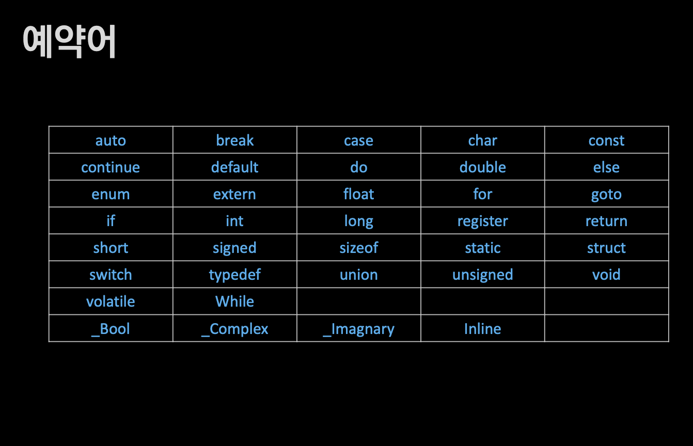

## 인프런 널널한 개발자님의 독하게 시작하는 C 프로그래밍
C언어 입문자를 위한 강의로, 너무 기초적인 부분은 생략하였음.

**파트2. C 프로그래밍의 시작**

#### 8. 개발환경 구축
중요한 세 가지 시점
- 컴파일 타임 :c.소스코드를 목적파일 ".obj"로 번역(기계어). 문법검사가 이루어진다.
- 링크 타임: 목적 파일들과 라이브러리(.lib)를 실행 파일로 합성.(=조립)
- 빌드 타임( 컴파일 + 링크타임 )
- 런타임(실행) ".obj"와 ".lib"를 합성해 실행파일 .exe 생성

#### 9. C언어 기초 문법
ASCII 코드 기준 문자 중 일부 사용가능하다.

항, 식, 구문, 실행

#### 10. 표준 입/출력

#### 11. 연산자

#### 12. 기본제어문

#### 13. 반복문

