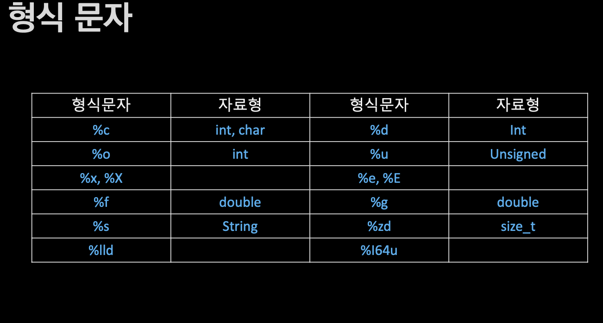
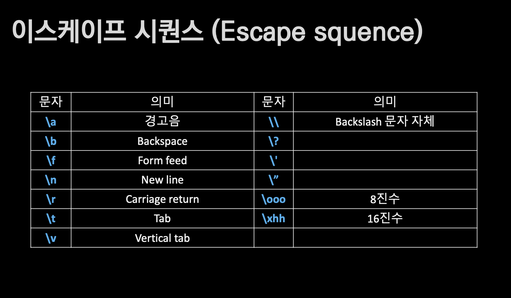

## 인프런 널널한 개발자님의 독하게 시작하는 C 프로그래밍
C언어 입문자를 위한 강의로, 너무 기초적인 부분은 생략하였음.

**파트2. C 프로그래밍의 시작**

#### 8. 개발환경 구축
중요한 세 가지 시점
- 컴파일 타임 :c.소스코드를 목적파일 ".obj"로 번역(기계어). 문법검사가 이루어진다.
- 링크 타임: 목적 파일들과 라이브러리(.lib)를 실행 파일로 합성.(=조립)
- 빌드 타임( 컴파일 + 링크타임 )
- 런타임(실행) ".obj"와 ".lib"를 합성해 실행파일 .exe 생성

#### 9. C언어 기초 문법
ASCII 코드 기준 문자 중 일부 사용가능하다.


항, 식, 구문, 실행
- 문자(피연산자, 변수나 상수)로 **항** 기술 
  - 항과 연산자가 모여 **식** 완성
- 식에 대한 **평가** (=연산)
- 식이 모여 **구문** 완성
    - 여러 구문을 중괄호로 묶을 수 있음
- 여러 줄의 구문을 연속 **실행(함수)**

#### 10. 표준 입/출력
Console과 CLI
- **CLI**(Command Line Interface) 기반 **HCI**(Human Computer Interface)는 키보드 입력으로 구현
- 키보드 입력 시 그 값은 메모리(I/O
Buffer= 입출력메모리)에 연속적으로 저장
- I/O Buffer에서 한 글자 단위로 처리

컴퓨터(CPU+RAM(=메모리))+주변기기(모니터, 키보드)에서, 키보드는 input, 모니터는 output 장치이다.  
Hardware와 CPU는 Interrupt가 발생하면  interrupt(~=신호) 번호에 따라 일을한다. 

컴퓨터= Software +Hardware  
Software= User mode + Kernel mode인데, kernelmode가 HW와 교류가능하다. usermode에서 직접적으로는 불가능하다. 
가장 중요한 부품은 CPU고, 그다음은 RAM이며, 나머지는 주변기기이다. 

문자입출력
- getchar() / putchar()
    - Buffered I/O(Queue 형태)
    - 값이 저장된 메모리 값을 읽거나 출력
- _getch() / _getche()
    - Non-buffered I/O
    - 키보드 입력 자체에 대한 감지
    - #include <conio.h>

문자열 입출력
- gets() / puts()
- gets_s()
- rintf() / scanf(), scanf_s()

gets() 함수의 보안 결함
- 매개변수로 메모리의 주소를 받지만
얼마나 써도 되는지 크기를 확인하지
않아 발생
- 메모리 경계를 벗어난 쓰기를 수행
- 보안 문제가 발생하지 않도록 코드
수준에서 대응 하는 것이 중요 (시큐어 코딩)
- gets_s(),fgets() 사용 




scanf(): (메모리의)주소 갖고 저장  
배열은 이름 자체가 메모리의 주소이다.  

#### 11. 연산자
연산자는 CPU연산과 직결되는 문법이다.

산술 연산과 형승격(Type promotion)
- 임시결과는 피연산자 표현범위 이상의 표현이 가능해야 함-> 표현범위 넓은 형으로 변환된다.
- char + int 결과는 int
- double * int 결과는 double
- 4 / 3과 4.0 / 3은 전혀 다른 연산
- ``` printf("%d\n", 5.0+2);``` 의 결과는 0임

0으로 나누면 안되는 이유
- 코딩시 절대적으로 사용자 입력은 신뢰하면 안된다. 
-7에서 0을 계속 빼면 언젠가는 0보다 작은 숫자를 만날 수 있는가? ->아님

비트 연산자
- 자료를 비트 단위로 논리 식을 수행하는 연산
- 보통 2진수로 변환해 판단
- AND, OR, NOT, XOR, Shift left(곱셈)), Shift right(나눗셈)
- NOT은 단항, 나머지는 모두 2항 연산자


#### 12. 기본제어문


#### 13. 반복문

