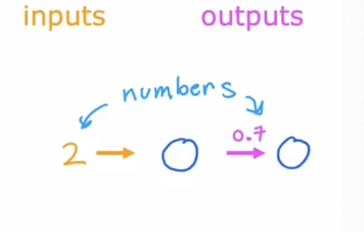
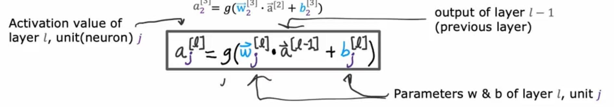
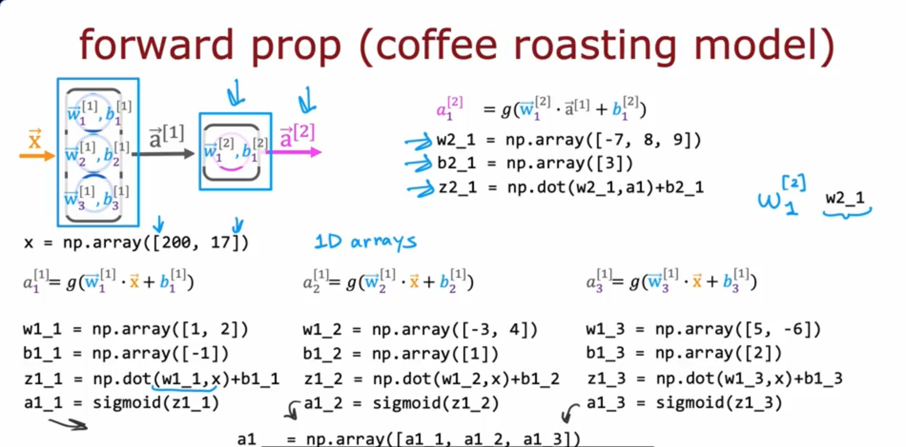
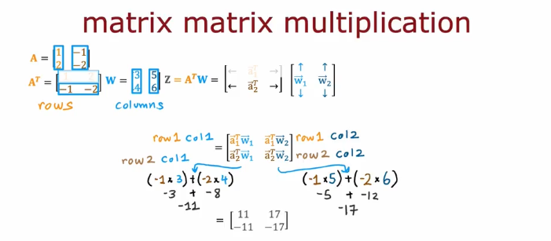

# Coursera - andrew ng
고급학습알고리즘: 신경망

### Neurons and the brain
Neural networks

origins:Algorithms that try to mimic the brain.
- speech ->images -> text(NLP) -> ...

input from other neurons -> impulse

Simplified mathematical model of a neuron


input a few numbers, carry computation, output 1 number.

데이터 수가 많아질 수록,
**traditional AI< small NN < medium NN <large neural NN** 
순으로 performance가 증가함.

### Demand Prediction
- x=practice, input
- a=f(x)=$1/(1+e^-(wx+b))$ = output
- x ->neuron -> probability of being ~..

layer:  grouping of neurons which takes as input the same or similar features, and that in turn outputs a few numbers together. it can have multiple neurons.

하나의 뉴런엔 1개이상의 인풋이 들어간다.

- input layer
- input feature vector: $\vec{x} $
- final neuron: output layer. activation values. final activation.. 
- hidden layer
- $\vec{a} $ : vector of activation

original data보다 한 번 이라도 계산된 값을 사용 하는게 더 잘 predict한다.
neuron network =: logistic regression

##### Multiple hidden layers
architeture
-how many hidden layers? 
-how many hidden neurons per layer?

### Example: Recognizing Images
1000x1000 픽셀 크기 이미지는 컴퓨터에서는 1000x1000그리드, = 픽셀 밝기 값으로 이루어진 행렬으로 표현된다.

이 픽셀 값을 모두 펼쳐 벡터로 만들면, 총 1백만 개의 값이 있는 벡터가 된다. (1000x1000이 1백만이다.)

신경망은 다음과 같이 구상할 수 있다.
- 입력이미지 X는 첫 번째 hidden layer의 뉴런들에 전달된다. 이 레이어는 특징을 추출 한 후 그 결과를 두 번째 레이어로 전달한다.
- 두 번째 레이어의 출력은 세 번째 레이어로 전달되고, 마지막 출력층에 도달하여 이 사람이 특정 인물일 확률을 추정하게 된다.

얼굴 이미지를 많이 학습한 신경망은 이 은닉층들이 무엇을 계산하려는지 시각화할 수 있다. 
- 첫 번째 은닉층에서는 어떤 뉴런은 수직선이나 수직 에지를 감지하고, 다른 뉴런은 대각선 방향의 선을 감지하는 식으로, 아주 짧은 선이나 에지를 감지한다.
- 그다음 은닉층에서는, 이런 짧은 선들을 조합해서 얼굴의 일부를 감지하려는 뉴런들이보인다.
- 각 사각형은 해당 뉴런이 감지하려는 특징을 나타내는데, 어떤 뉴런은 특정 위치에 눈이 있는지 감지하려 하고, 또 다른 뉴런은 코의 모서리나 귀의 아랫부분을 감지하려 한다. 
- 세 번째 은닉층에서는 얼굴의 더 큰 형태나 구성요소를 인식하도록 학습된다.
이렇게 계층적으로 얼굴의 세부 요소부터 전체 구조까지 인식한 결과, 출력층에서는 이 얼굴이 누구인지 판별하는 데 도움을준다.

특이점은, 이 모든 추출 기능을 신경망이 "스스로 학습"한다는 것이다.

 신경망에게 첫 번째 층에서는 에지를, 두 번째 층에서는 눈이나 코 같은 얼굴 부위를, 세 번째 층에서는 얼굴 전체 모양을 감지하라고 알려주지 않았지만, 신경망은 데이터를 통해 이런 것들을 스스로 학습한다.

 즉, 데이터만 바꿔도 신경망은 알아서 그에 맞는 특징을 추출하고 학습하게 된다.

activations are higher level features


## Neural network model

### Neural network layer
ex:hidden layer 3 neurons, 4 input numbers
$$ g(z) = \frac{1}{1 + e^{-z}} $$
$z=w*x+b$

hidden layer[1]에서

first neuron has parameter w,b, activationvalue a.   
$ \vec{w_1},b_1   a_1=g(\vec{w_1} * \vec{x} +b_1)*0.3 $

second neuron  
$ \vec{w_2},b_2   a_2=g(\vec{w_2} * \vec{x} +b_2)*0.7 $

third neuron  (=third unit)
$ \vec{w_3},b_3   a_3=g(\vec{w_3} * \vec{x} +b_3)*0.2 $

- input layer= layer0이고 이후로 layer 1, 2, ...n으로 불려진다.   
- notation for layer numbering: layer 1 = [1]
- input layer는 layer[0]라고도 불림
- output value는 scalar value이다.
-[2]의 인풋은 [1]의 아웃풋이다. 

$\vec{a}^{[1]}$ : vector of activation values from layer 1. **not a single vector **

### More complex neural networks
레이어 수를 셀 때 인풋레이어는 카운트하지않는다.
- $\vec{a}_{1}^{[3]}$ : 3번째 레이어의 1번째 유닛의 activation value
- $\vec{w}_{2}^{[3]}$ : 3번째 레이어의 2번째 유닛의 가중치
- $\vec{b}_{3}^{[3]}$  : 3번째 레이어의 3번째 유닛의 bias


g: sigmoid function = activation function

### Inference: making predictions(forward propagation)

$\vec{a}^{[n]}$ 벡터는 hidden layer[n]의 unit수 만큼의 벡터를 가짐

x부터 a1, a2, a3로 진행되는 이 계산과정을 forward propagation이라고 함.

## TensorFlow 구현
### Inference in Code
same algorithm can be applied to different applications.

```
x=np.array([[200, 17.0]])
layer_1=Dense(units=3, activation='sigmoid')
a1=layer_1(x) 

layer_2=Dense(units=1, activation='sigmoid' )
a2=layer_2(a1)
```

### Data in Tensorflow
왜 x=np.array([[]]) 에서 bracket을 두 개 칠까?

(row  x col) matrix 의 n차원 매트릭스는 np.array([[]])형태로 저장된다. 즉 matrix는 숫자들의 2D형태 인 것이다. 
- row vector: just single row
- column vecotr: just single column
- 1D vector: no column or row. linear array.
```
layer_2=Dense(units=1, activation='sigmoid' )
a2=layer_2(a1)
#a2=[[0.8]]
#tf.Tensor([[0.8]], shape=(1,1), dtype=float32)
a2.numpy()
#array([[0.8]], dtype=float32)

tf.Tensor([[0.2 0.7 0.3]], shape=(1,3), dtype=float32)
#tensor는 연산을 저장하고 수행함. 매트리스를 나타내는 방식 중 하나임
a1.numpy() #a1을 tensor에서 Numpy형태로 변경 가능
#array([[0.2, 0.7, 0.3]], dtype-float32)
```
tensor형을 언제든 numpy형으로 convert가능하다.

### Building a neural network
```
layer_1=Dense(units=3, activation="sigmoid")
layer_2=Dense(units=1, activation="sigmoid")
model=Sequential([layer_1, layer_2])
# or model=Sequnetial([layer_1=Dense(units=3, activation="sigmoid"),layer_2=Dense(units=1, activation="sigmoid")])

model.compile(...) #train network
model.fit(x,y)  #take this neural network are created by sequentially, train it on data X on Y
model.predict(s_new)
```
sequential function은 sequentially하게 모델을 생성함.

## Neural network implementation in Python
### Forward prop in a single layer


### General implementation of forward propagation
```
W=np.array([
    [1,-3,5]
    [2,4,-6]])
b=np.array([-1,1,2])
a_in=np.array([-2,4])

def dens(a_in, W,b):
    units=W.shape[1] #[0,0,0]
    a_out=np.zeros(units)
    for j in range(units): #0,1,2
        w=W[:,j]
        z=np.dot(w,a_in)+b[j]
        a_out[j]=g(z) #g()is defined outside of dense()
    return a_out

def sequential(x):
    a1=dense(x,W1,b1)
    a2=dense(a2,W2,b2)
    a3=dense(a2,W3,b3)
    ar=dense(a3,W4,b4)
    f_x=a4
    return f_x

#capital W refers to a matrix
```
## Speculations of artificial general intelligence (AGI)
### Is there a path to AGI?

AI
- ANI : artificial narrow intelligence (self-driving car, web search ...)
- AGI : artificial general intelligence. Do anything human can do 

We have(almost) no idea how the brain works

## vectorization
### How neural networks are implemented efficiently
Matmul is how Numpy carries out matrix multiplication

For loops 방식
```
x=np.array([[200,17]])
W=np.array([
    [1,-3,5]
    [2,4,-6]])
b=np.array([-1,1,2])
a_in=np.array([-2,4])

def dens(a_in, W,b):
    units=W.shape[1] #[0,0,0]
    a_out=np.zeros(units)
    for j in range(units): #0,1,2
        w=W[:,j]
        z=np.dot(w,a_in)+b[j]
        a_out[j]=g(z) #g()is defined outside of dense()
    return a_out # [1,0,1]
```
vectorization   방식
```
X=np.array([[200,17]]) #2D array
W=np.array([ #same
    [1,-3,5]
    [2,4,-6]])
B=np.array([-1,1,2]) #1*3 2D array

def dens(A-in, W,B):
    #multiplication
    Z=np.matmul(A_in,W)+B #vectorized
    A_out=g(Z) #vectorized matrix
    return A_out ##[[1,0,1]]
```
### matrix multiplication
- dot product
- transpose

$ z= \vec{a}*\vec{a} = \vec{a}^{T}*\vec{w} $

만약 w가 row가 2 이상이라면,  
$Z=[ \vec{a}^{T}*\vec{w_1} ,\vec{a}^{T}*\vec{w_2} ]$

a,w 둘 다 row, col이 2 이상이라면  


### Matrix multiplication rules

### Matrix multiplication code
AT=A.T : transpose


