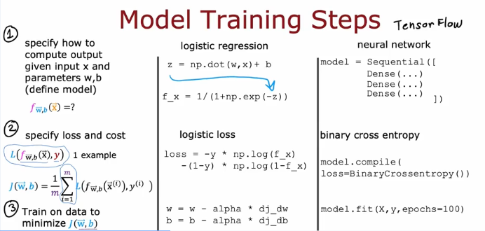
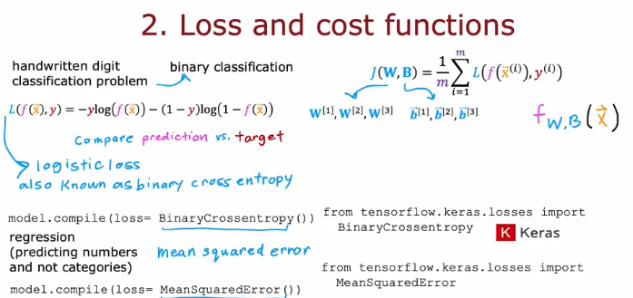
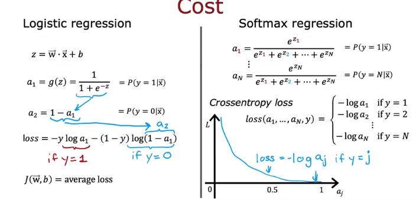

# Coursera - andrew ng
고급학습알고리즘: 신경망

## Neural Network Training
### TensorFlow implementation
```
import tensorflow as tf
from tensorflow.keras import Sequential
from tensorflow.keras.layers import Dense
    model=Sequential([ #1
        Dense(units=25, activation=;sigmod),
        Dense(units=15, activation='sigmod),
        Dense(units=1, activation='sigmoid'),
        ])
    
    from tensorflow.kera.losses import
    BinaryCrossentropy
        model.compile(loss=BinaryCrossentropy())#2
        model.fit(X,Y,epochs=100 ) #3
```
1. specify model
2. compiles model using a specific loss function
3. train model

### Training Details

1. specify how to compute output iven input x and parameters w,b(define model)

2. specify loss and cost

3. Train on data to minimize $ J(\vec{w}, b) $
- Gradient descent
$
\text{repeat} \; \left\{ 
\begin{aligned}
w_j^{[l]} &= w_j^{[l]} - \alpha \frac{\partial}{\partial w_j} J(\vec{w}, b) \\
b_j^{[l]} &= b_j^{[l]} - \alpha \frac{\partial}{\partial b_j} J(\vec{w}, b)
\end{aligned}
\right\}
$
```
model.fit(X,y,epochs=100) #compute derivatives for gradient descent using "back propagation"
```

## Activation Functions
### Alternatives to the sigmoid activation
Linear activation function
- No activation function
- g(z)=z

Sigmoid
- 0< g(z) <1
- $g(z)=1/1+e^(-z)

ReLU function
- g(z)=max(0,z)
- Rectified Linear Unit

## Choosing activation functions
- a binary classification problem, use **sigmoid**. y=0/1
- Regression, Linear activation function. y=+/-
- Regression, RELU. Y=0 or +

label y에 따라 선택할 수 있다. 

ReLU가 sigmoid보다 잘 안쓰임. 일부 예외 제외
- ReLU가 조금더 빠름

### Why do we need activation functions?

linear fuction is itself linear function. just linear function  
->아무리 계산을 반복해도 linear function형태로 나옴

## Multiclass classification
### Multiclass
multiclas classification problem: y can take on more than 2 posible values

### Softmax
모든 y확률을 더하면 1이된다.

Softmax regression(N possible outputs)
- y= 1,2,3,...,N  
$ z_j=\vec{w_{j}}*\vec{x} + b_j  j=1,..,N $
- $ a_j = \frac{e^{z_j}}{\sum_{k=1}^{N} e^{z_k}} = \mathbb{P}(y = j \mid \vec{x})$
- note : $a_1+ a_2 + ... a_N =1 $

Cost

aj가 작아지면 L이 증가함 

### Neural Network with Softmax output
1.specify the model
```
Dense(units=10, activation='softmax')
```
2.specify loss and cost
```
from tensorflow.koras.losses. import SparseCategoricalCrossentropy
```

3.Train on data to minimize J

### Improved implementation of softmax
```
Dense(units=10, activation='softmax')
model.compile(loss=SparseCategoricalCrossEntropy())
```
from_logits=True를 쓰면 softmax를 따로 하지 않아도 되고,
내부에서 알아서 softmax + crossentropy를 같이 계산
따라서 softmax를 쓴 것과 거의 같지만, 코드에는 명시적으로 softmax가 없다는 점이 차이
```
Dense(units=10, activation='linear)
model.compile(loss-SparseCategoricalCrossEntropy(from_logits=True))
```

### Classification with multiple outputs
Alternatevly train one neurons with 3 outputs

## Additional Neural Network Concepts
### Advanced Optimization
 Adam algorithm : Go faster 
- increase $ - \alpha $
- Go slower(smooth) - decrease $\alpha $

Adam: Adaptive Movement estimation
- not just one $\alpha $

- If w_j(or b) keeps moving in same direction, increase ${\alpha_j}
- If w_j(or b) keeps oscillating, reduce ${\alpha_j}

compile
```
model.compile(optimizer=tf.keras.optimizers.Adam(learning_rate=le-3),  # alpha = 10^-3 = 0.001
    loss=tf.keras.losses.SparseCategoricalCrossentropy(from_logits=True))
```
### Additional Layer Types
Each neuron output is a function of all the activation outputs of the previous layer.

**  Colvolutional Layer **
- Each neuron only looks at part of the previous layer's outputs

Why?
- Faster computation
- Need less training data ( less prone to overfitting)

## Backprop intution
### What is a derivative?
w goes up by epsilon, then J goes up roughly

변화율=: w의 도함수

"partial derivative"
$$
\text{If } f(w) \text{ is a function of one variable } (w),\\[5pt]
\quad d \quad \Rightarrow \quad \frac{d}{dw} J(w)\\[10pt]

\text{If } f(w_1, w_2, \ldots, w_n) \text{ is a function of more than one variable},\\[5pt]
\quad \partial \quad \Rightarrow \quad \frac{\partial}{\partial w_i} J(w_1, w_2, \ldots, w_n) 
\quad \text{or} \quad \frac{\partial J}{\partial w_i}
$$

### Computational graph
신경망은 여러층의 함수로 구성되기 때문에, 합성함수이다. 
이를 미분하려면 출력에서 입력까지 하나씩 미분해서 곱하는 방식이다.
이 과정을 수백 층에 걸쳐 적용하면 굉장히 복잡하고 비효율적이 된다.

Backporp은 효율적으로 계산 가능하다
- Forward pass: 각 층에서 나오는 중간결과 (ex:z,a)를 저장해둔다
- Backward pass: chainrule을 따라 출력층부터 한 단계씩 미분을 계산한다
- 이 때 중간결과를 재사용하여 같은 계산의 반복을 안 해도 된다.

- Compute \( \frac{\partial J}{\partial a} \) once and reuse it to compute  
  both \( \frac{\partial J}{\partial w} \) and \( \frac{\partial J}{\partial b} \).

- If there are **N nodes** and **P parameters**,  
  derivatives can be computed in roughly **\( N + P \)** steps  
  rather than **\( N \times P \)** steps.

  ### Larger Neural Network Example

  