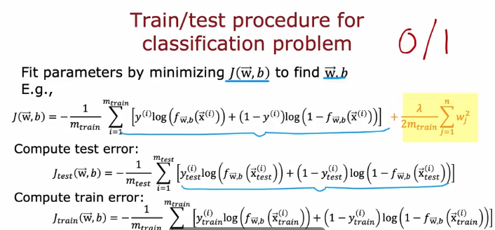
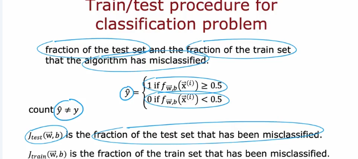
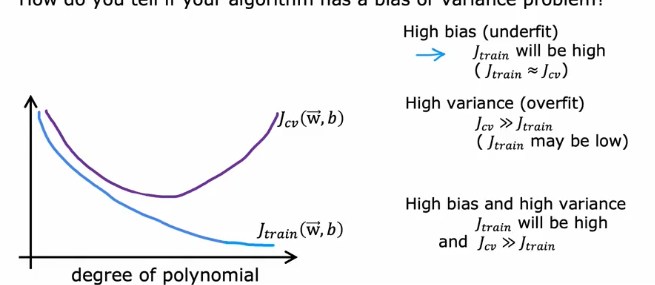
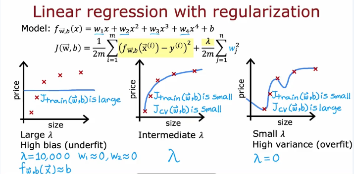
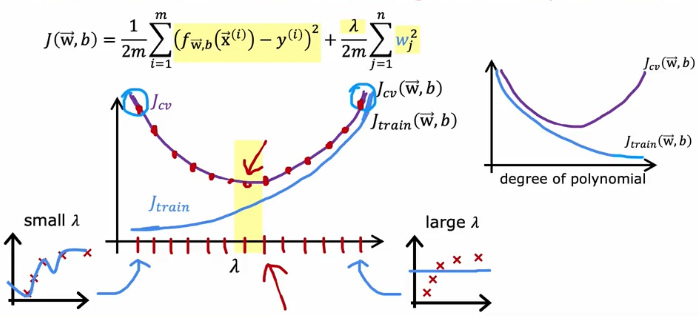
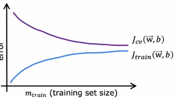
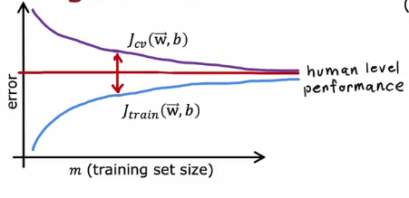
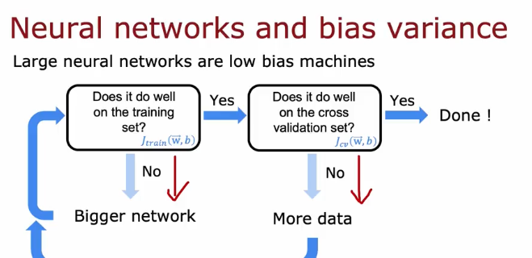
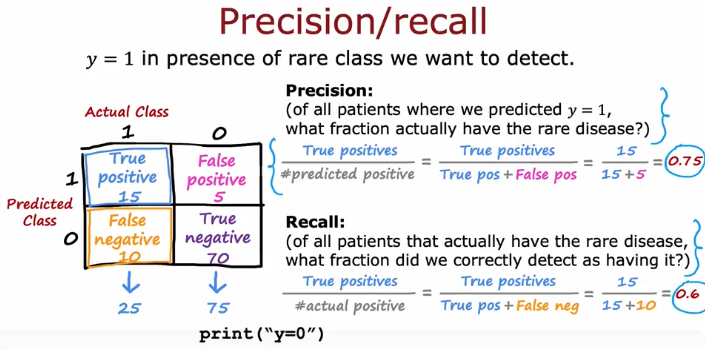
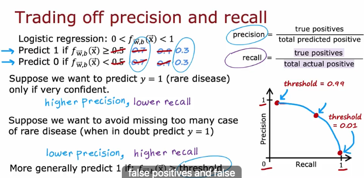

# Coursera - andrew ng
고급학습알고리즘: 신경망

## Advice for applying machine learning
### Deciding what to try next

만약 model makes unacceptably large errors in predictions. What do you try next?

- get more training examples
- try samller sets of features
- try getting additional features
- try adding polynomial features (x)
- try decreasing lambda
- try increasing lambda

Diagnostic: A test that you run to gain insight into what is/isn't working with a learning algorithm, to gain guidance into improving its performance.

Diagnotics can take time to implement but doing so can be a very good use of your time.

### Evaluating a model
Model fits the training data well but will fail to generalize to new examples not in the training set.

- $m_{traing} $ = no.training examples

보통 80%를 training, 20%를 test용으로 사용

Fit parameters by minimizing cost function J(w,b)

$$
J(\vec{w}, b) = \left[ \frac{1}{2m_{\text{train}}} \sum_{i=1}^{m_{\text{train}}} \left( f_{\vec{w}, b}(\vec{x}^{(i)}) - y^{(i)} \right)^2 + \frac{\lambda}{2m_{\text{train}}} \sum_{j=1}^{n} w_j^2 \right]
$$
$$
J_{\text{test}}(\vec{w}, b) = \frac{1}{2m_{\text{test}}} 
\left[ \sum_{i=1}^{m_{\text{test}}} 
\left( f_{\vec{w}, b}(\vec{x}^{(i)}_{\text{test}}) - y^{(i)}_{\text{test}} \right)^2 \right]
$$

### Model selection and training/cross validation/test sets
Once parameters w,b are fit to the training set, the training error J_train is likely lower than the actual generalized error.

J_test is better estimate of how well the model will generalize to new data compared to J_train

- d=degree. parameter 개수

decide what degree polynomial to use

60% training set, 20% cross validation(cv), 20% test set.

cross validation = validatio set = development set = dev set

**Training error:**

\[
J_{\text{train}}(\vec{w}, b) = \frac{1}{2m_{\text{train}}} \left[ \sum_{i=1}^{m_{\text{train}}} \left( f_{\vec{w}, b}(\vec{x}^{(i)}) - y^{(i)} \right)^2 \right]
\]

**Cross validation error:**

\[
J_{\text{cv}}(\vec{w}, b) = \frac{1}{2m_{\text{cv}}} \left[ \sum_{i=1}^{m_{\text{cv}}} \left( f_{\vec{w}, b}(\vec{x}^{(i)}_{\text{cv}}) - y^{(i)}_{\text{cv}} \right)^2 \right]
\quad \text{(validation error, dev error)}
\]

**Test error:**

\[
J_{\text{test}}(\vec{w}, b) = \frac{1}{2m_{\text{test}}} \left[ \sum_{i=1}^{m_{\text{test}}} \left( f_{\vec{w}, b}(\vec{x}^{(i)}_{\text{test}}) - y^{(i)}_{\text{test}} \right)^2 \right]
\]

## Bias and variance
### Diagnosing bias and variance
- High bias(under fit)
    - Jtrain is high
    - Jcv is high
    - d=1
- Just right 
    - Jtrain is low
    - Jcv is low
    - d=2
-High variance (overfit)
    - Jtraing is low
    - Jcv is high
    - d=4

공통점: high bias means is not even doing well on the training set, and high variance means, it does much worse on the cross validation set than the training set.

### regularization and bias/variance

### Establishing a baseline level of performance
What is the level of error you can reasonably hope to get to?
- Human level performance
- competing algorithms performance
- guess based on experience

### learning curve

High bias

average training error flattens after while

아무리 m이 커져도 flat함

If a learning algorithm suffers from high bias, getting more training data will not (by itself) help much

High variance

If a learning algorithm suffers8x from high variance, getting more training data likely to help. 

###  Deciding what to try next revisted

 model makes unacceptably large errors in predictions. What do you try next?

high bias(under fit)
high variance (over fit)

- get more training examples : fixes high variance
- try samller sets of features(x) : fixes high variance
- try getting additional features : fixes high bias
- try adding polynomial features (x) : fixes high bias
- try decreasing lambda : fixes high bias
- try increasing lambda : fixes high variance

### bias/variance and neural networks

- simple model, High bias
- Complex model, High variance

- bigger neuron network: more hidden layers or more hidden units per layer, GPU.

A large neural network will usually do as well or better than a smaller one so long as regularization is chosen appropriately.

## Machine learning development process
### Iterative loop of ML development

Loop of ML development
- Choose architectur
- Train model
- Diagnostics

### Error analysis
만약 m_cv=500이고, algorithm이 그 중 100개를 misclassifies했다면, 

Manually examine 100 examples and categorize them based on common trait

How to try to reduce your classifier's error?
- Collect more data
- Develop sophisticated features
- Define sophisticated features
- Design algorithm

### Adding data

Data augmentation 

augmentation: modifying an existing training example to create a new training example.

data augmentation by introducing distortions

usually does not help to add purely random /meaningless noise toyour data

Synthesis:using artificial data inputs to create new training data

AI = Code(algorithm/model) + Data

- Conventional model -centric approach : Code
- Data-centric approach : Data

### Transfer learning: using data from a different task
- option 1. only train output layers parameters (작은모델) : suprevised pretraining
- option 2. traing all parameters (큰모델) :fine-tuning

summary
1. download neural network param pretrained on a large dataset with same input type as your application
2. Further train(fine tune)the network on your own data.

### Full cycle of a machine learning project
Cycle of a machine learning project
- Scope project : Define project
- Collect Data : Define and collect data
- Train model : Training, error analysis & iterative improvement
- Deploy in production : Deploy, monitor and maintain system

software enginerring may be needed for:
- ensure reliable and efficient predictions
- scaling
- logging
- system monitoring
- model updates

MLOps : machine learning operations

### Fairness, bias, and ethics
adverse use cases
- deepfakes
- toxic/incendiary speech
- generating fake content
- using Ml to build harmful

- 가이드라인: 잘못되거나 취약층에 해로울 수 있는 내용 금지
- 기준/가이드라인에 대한 반복적 연구 할 것
- audit system
- 플랜을 잘 짜고 개발 후에도 모니터링 할 것

## Skewed datasets
### error metrics for skewed datasets
y=1 disease, y=0 otherwise.  
only 0.5% patients have the disesas,  
print(y=0)   
99.5% accuracy?

'confusion matrix'

### Trading off precision and recall

F1 score : how to compare precision/recall numbers?

- Precision(P) Recall(R)
- Average = $ {P+R}/2 $ -> not good

$F_{1}$ score:  \[ F_1 = 2 \cdot \frac{\text{Precision} \cdot \text{Recall}}{\text{Precision} + \text{Recall}}\]

