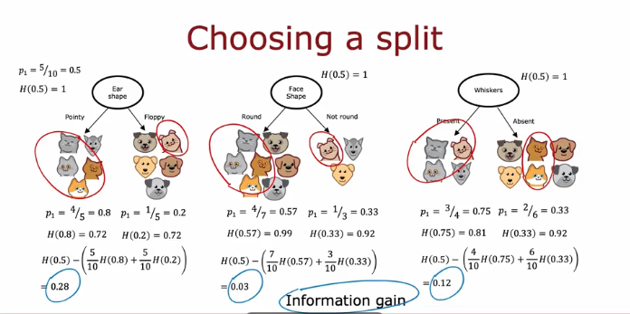

# Coursera - andrew ng
고급학습알고리즘: 신경망

## Decision Trees
### Decision Tree Model
이산수학에 나오는 트리와 동일

### Learning process

Decisino 1. hot wo choose what feature to split on  at each node?
- Maximize purity(or minimize impurity)

D 2. When do you stop splitting?
- when a node is 100% one class
- When spliting a node will result in the tree exceeding a maximum depth
- When improvements in purity score are below a threshold
- When number of examples in a node is below a threshold

## Decisino Tree Learning
### Measuring purity

entropy as a measure of impurity

entropy function H($p_1$)  
$p_1$ : fraction of examples that are 1

\[H(p_1) = - p_1 \log_{2}(p_1) - p_0 \log_{2}(p_0)\]
\[= - p_1 \log_{2}(p_1) - (1 - p_1) \log_{2}(1 - p_1)\]

### Choosing a split: information gain


\[
H(p_1^{\text{root}}) - \left( w^{\text{left}} H(p_1^{\text{left}}) + w^{\text{right}} H(p_1^{\text{right}}) \right)
\]

information gain = 분할 전 엔트로피 − 분할 후 엔트로피들의 가중 평균
### Putting it together
Decision Tree Learning
- Start with all examples at the root node 
- Calculate inforamtion gain for all possible features, and pich the one with the highest information gain
- Split dataset according to selected feature, and create left and right branches of the tree
- Keep repeating splitting process until stopping criteria is met:
    - When a node is 100% one class
    - When splitting a node will result in the tree exceeding a maximum depth
    - Information gain from additional splits is less than threshold
    - When number of examples in a node is below a threshold

Recursive algorithm

### Using one-hot encoding of categorical features
ear shape가 pointy, floppy, oavl ear로 나뉠 때 이에 대해 1,0,0/ 0,0,0 처럼 나타낼 수 있다.

If a categorical feature can take on k values, create k binary features (0 or 1 valued).

### Continuous valued features
tree가 continuous valued features로 분류할 수 있기 위해서는
when consuming split, you would just consider differents values to split on,
carry out the usual information gain calculation and decide to split
feature to get continou valued feature

### Regression Trees(optional)
엔트로피를 줄이는 것 대신 variance of the weight of the values Y at each of theset substes of the data의 방향으로도 행동 가능함.

### Using multiple tree
tree ensemble : collection of tree

less sensetive algorithm 가능 해짐

### sampling with replacement
더미에서 randomly pick sample을 반복한다. 같은 샘플을 뽑더라도 샘플 수만큼 반복한다. 

training sample이 original training을 다 포함할 수 없을수도 있지만 괜찮음

### Random forest algorithm
given training set of size m

For b=1 to B: Use sampling with replacement to create a new training set of size m

B가 너무 커진다고 더 좋은 결과가 나오는건 아니다. 

"Bagged decision tree"

Randoming the feature choice

At each node, when choosing a feature to use to split, 
if n features are available, pica a random subset of k<n features
and allow the algorithm to only choose from that subsets of features.

k=sqrt(n)인게 좋다.

### XGBoost
given training set of size m

For b=1 to **B**: Use sampling with replacement to create a new training set of size m

->** But instead of picking from all examples with equal (1/m) probability, make it more liekly to pick misclassified examples from previously trained trees ** "deliberated practice"

Train a decision tree on the new dataset

XGBoost (eXtreme Gradient Boosting)
- open source implementation of boosted trees
- fast efficient implementation
- good choice of default splitting criteria and criterai for when to stop splitting
- built in regularization to prevent overfitting
- highly competive algorithm for ML competitions (eg: Kaggle)

Classification
```python
from xgboost import XGBClassifier
model - XGBClassifier()

model.fit(X_train, y_train)
y_pred=model. predict(X_test)
```

Regression
```python
from xgboost import XGBRegressor
model -XGBRegressor()
model.fit(X_train, y_train)
y_pred=model.predict(X_test)
```

### When to use decision trees
decision tree vs neural networks

decision trees and tree ensembles
- works well on tabular(structed) data
- not recommended for unstructed data(images, audio, text)
- fast
- small decision trees may be humal interpretable

Neural network
- works well on all types of data, in cluding tabular and unstructered data
- may be slower than a decision tree
- works with transfer learning
- when building a system of multiple models working together, it might be easier to string together multiple neural networks


