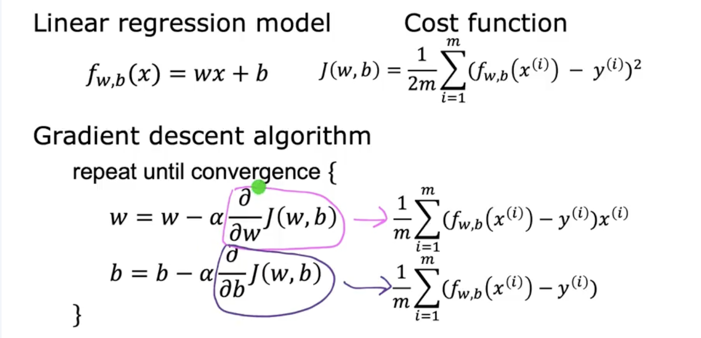

# Coursera - andrew ng
지도기계학습: 회귀 및 분류 - 모듈1. 머신러닝 소개

## Machine learning algorithms
- supervised learning : real- world applications, rapid advancements 
- unsupervised learning: 
-
- ..

### suprevised learning 
x에 y를 mapping하는 것

Input->Output 에서  
학습할 "맞는 답" 예시를 직접 줌

ex)이메일 -> 스팸?(0/1)

- Regression : ex)부동산 가격 예측하기
- line / curve
algorithm의 역할: accuracy 높이기

### Classification 
지도학습이 이렇게도 불림

ex) 종양 크기로 암진단하기
->  0, 1 외에도 다른 output 카테고리가 존재 가능한 문제

- classification class, predcit category : 숫자일수도 특정 상태(개, 고양이)일수도 있음

- input도 2가지 이상일 수 있음.

### unsupervised learning

input을 주고 정답을 알려주지 않음. **unlabeled data**에서 **structure**를 찾는 것

- Clustering : ex)DNA microarray
- group similar data

- Anomaly detection
- Find unusual data points

- Dimensionality reduction

## Linear regression model

- linear regression: data set to straight line
  - regression model :predicts numbers
  - classification model :predict categories

terminology
- dataset, data used to train the model

- x = input, feature variable
- y = output, target variable
- m = number of training examples
- (x,y) = single training example 
- $ (x^(i), y^(i)) $ : ith training example

function f : x-에대한 y생성 prediction/estimation
model f : feature x, prediction(estimated) y
$$ f_{w,b}(x) = wx+b $$

linear function : one variable 

non-linear function(curve/ parabola)

### Cost Function
$$ f_{w,b}(x) = wx+b $$
- w,b = weights, coefficients

w는 linear function의 기울기와 같음

CostFunction: 머신러닝 모델이 얼마나 잘 작동하고 있는지 수치로 평가하는 함수.

### Cost Function Intution
recap 
- model : $$ f_{w,b}(x) = wx+b $$
- parameters : w, b
- cost function: 
$$
J(w, b) = \frac{1}{2m} \sum_{i=1}^{m} \left( f_{w,b}(x^{(i)}) - y^{(i)} \right)^2
$$
- goal : minimizeJ(w,b)

**simplified**
- $$f_w(x) = wx$$
- parameter : w
- cost function : $$\frac{1}{2m} \sum_{i=1}^{m} \left( f_{w}(x^{(i)}) - y^{(i)} \right)^2
$$
- goal : minimizeJ(w)  
J is function of w  
비용 J가 작아야 w,b가 데이터에 잘 맞는다는 뜻임  

### CostFunction Visualization

## 기울기 하강으로 모델훈련 
<그라데이션 하강>
- greadient descendent -> try to minimize J
- 처음엔 w,b =0으로 시작함.
- 한 특정점을 잡고 극소, 최소 값까지 서서히 감소 

<경사도 하강 구현>  
Gradient descent algorithm
= : assignment operator
α = learning rate.   
α 값에 따라 w,b를 조금씩 업데이트함  

$$
\textit{tmp\_w} = w - \alpha \frac{\partial}{\partial w} J(w, b)
$$
tmp_w가 tmp_b 계산과정에 들어가게 되는것임
$$
\textit{tmp\_b} = b - \alpha \frac{\partial}{\partial b} J(w, b)
$$
w=tmp_w
b=tmp_b

Simultaneously update w and b
old w-> new w 동시에 old b-> new b
한꺼번에 계산하고 대입하면안됨. 

$$ w= w-α \frac{\partial}{\partial w} J(w) $$
$\frac{\partial}{\partial w} J(w) $ 가 양수인경우, w-양수 이므로 w의 값은 업데이트 이후 감소할 것이다. (알파가 양수라는 가정. )

### 학습속도

α가 매우 매우 작은 수 일때, 매우 느리게 J가 변화함.  
Gradient가 작동하겠지만 ***너무*** 느리다.

α가 매우매우 클 때, 매우 빠르게 J가 변화함.  
cost J가 더 나빠질 수도 있음, 업데이트 할 수록 최소값에서 멀어질 수도 있음.

J가 이미 극솟값일 때, 최솟값에 도달한 것일까? 
극솟점에선$\frac{\partial}{\partial w} J(w) $가 0일것이다.  
w=w-α*0 이므로 w=w가 됨. 즉 업데이트 이후에도 절대로 아무것도 변하지 않을것이다. 
극대/극소에선 알파값을 아무리 바꾸더라도 J값이 변하지 않게된다. 

극대/극소로 갈 수록 $\frac{\partial}{\partial w} J(w) $값이 작아진다. 점점 조금씩 움직이게 된다. 즉 알파값을 낮추지않고 minimum에 도달할 수 있게된다.

### 선형회귀를 위한 그라데이션 하강

$$
\documentclass{article}
\usepackage{amsmath}
\begin{document}

\section*{Gradient of Cost Function with respect to \( w \)}

선형 회귀에서 비용 함수 \( J(w, b) \)에 대해 가중치 \( w \)에 대한 편미분을 계산하면 다음과 같습니다:

\[
J(w, b) = \frac{1}{2m} \sum_{i=1}^{m} \left( f_{w,b}(x^{(i)}) - y^{(i)} \right)^2
= \frac{1}{2m} \sum_{i=1}^{m} \left( wx^{(i)} + b - y^{(i)} \right)^2
\]

\[
\frac{\partial}{\partial w} J(w, b)
= \frac{d}{dw} \left[ \frac{1}{2m} \sum_{i=1}^{m} \left( wx^{(i)} + b - y^{(i)} \right)^2 \right]
\]

상수를 밖으로 빼고, 합 안으로 미분을 적용하면:

\[
= \frac{1}{2m} \sum_{i=1}^{m} \frac{d}{dw} \left( wx^{(i)} + b - y^{(i)} \right)^2
\]

체인 룰을 적용하여:

\[
= \frac{1}{2m} \sum_{i=1}^{m} 2 \left( wx^{(i)} + b - y^{(i)} \right) \cdot x^{(i)}
\]

상수 및 공통항 정리:

\[
= \frac{1}{m} \sum_{i=1}^{m} \left( wx^{(i)} + b - y^{(i)} \right) x^{(i)}
\]

최종 정리:

\[
= \frac{1}{m} \sum_{i=1}^{m} \left( f_{w,b}(x^{(i)}) - y^{(i)} \right) x^{(i)}
\]

\end{document}
\documentclass{article}
\usepackage{amsmath}
\begin{document}

\section*{Gradient of Cost Function with respect to \( b \)}

선형 회귀의 비용 함수 \( J(w, b) \)에 대해 절편 \( b \)에 대한 편미분은 다음과 같습니다:

\[
\frac{\partial}{\partial b} J(w, b)
= \frac{\partial}{\partial b} \left[ \frac{1}{2m} \sum_{i=1}^{m} \left( f_{w,b}(x^{(i)}) - y^{(i)} \right)^2 \right]
\]

\[
= \frac{\partial}{\partial b} \left[ \frac{1}{2m} \sum_{i=1}^{m} \left( wx^{(i)} + b - y^{(i)} \right)^2 \right]
\]

\[
= \frac{1}{2m} \sum_{i=1}^{m} \frac{d}{db} \left( wx^{(i)} + b - y^{(i)} \right)^2
\]

체인 룰을 적용하여:

\[
= \frac{1}{2m} \sum_{i=1}^{m} 2 \left( wx^{(i)} + b - y^{(i)} \right)
\]

\[
= \frac{1}{m} \sum_{i=1}^{m} \left( wx^{(i)} + b - y^{(i)} \right)
\]

\[
= \frac{1}{m} \sum_{i=1}^{m} \left( f_{w,b}(x^{(i)}) - y^{(i)} \right)
\]

\end{document} $$

Remind update w,b simultaenously.

linear regression은 single global minimum만 존재한다. 

### 러닝 경사 하강

Batch: Each step of gradient descent uses all the training examples 
