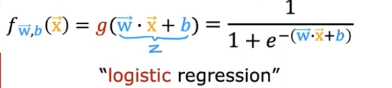
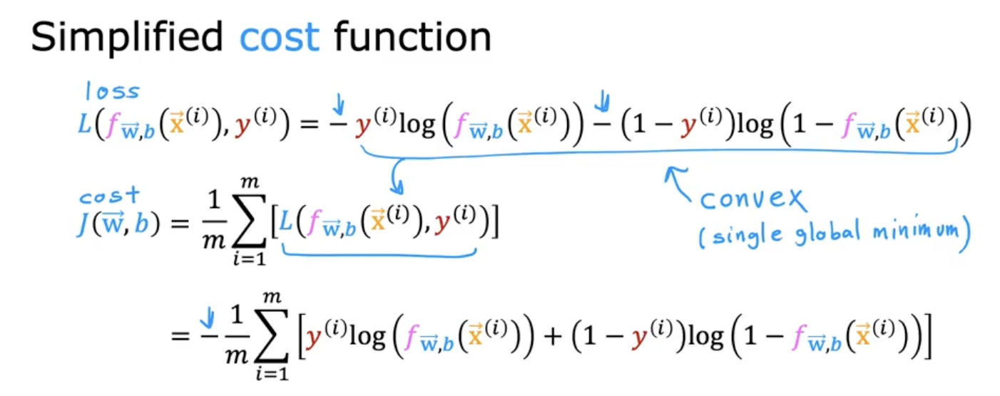
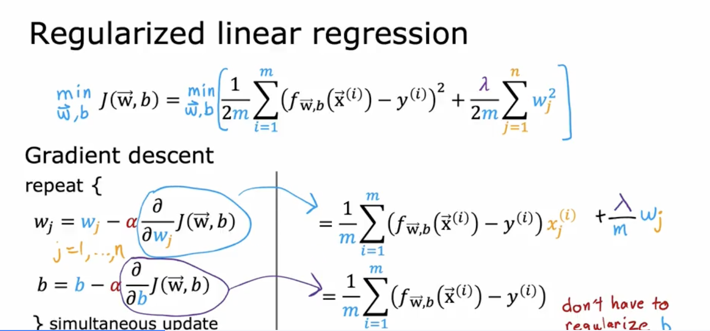

# Coursera - andrew ng
지도기계학습: 회귀 및 분류 - 모듈3. classification

## 로지스틱 회귀를 통한 분류
Linear regression는 input에 비례한 수치를 예측한다면, Logistic regression는 input을 바탕으로 class(0 or 1)을 classification

#### 로지스틱 회귀

- sigmoid function  
- logistic function 
- outputs between 0 and 1   
- z가 클 수록 시그모이드가 1에 가까워짐
- z가 작을 수록 시그모이드가 0에 가까워짐

$$ g(z) = 1/(1+e^-z), 0<g(x)<1 $$
$$ z = \vec{w} * \vec{x} +b $$

$f_{w,b}(x)=0.7$이라면, 70%확률로 Y가 1인 것임.
- P(y=1|x;w,b) : x,w,b에 대하여  Y가 1일 확률
- P(y=0) + P(y=1) =1

#### Decision Boundary 

When is 
-F(x)>=0.5 ?
-g(z) >=0.5?
- z>=0? 
  - wx+b >=0? y=1
  - wx+b <0? y=0

임계값이 꼭 0.5일 필요는 없다. 적절하게 설정해야한다.

## 로지스틱 회귀를 위한 비용 함수

squared error cost
$$ J(\vec{w}, b) = \frac{1}{m} \sum_{i=1}^{m} \frac{1}{2} \left( f_{\vec{w}, b}(\vec{x}^{(i)}) - y^{(i)} \right)^2 $$
$$ loss = L(f_{\vec{w}, b}(\vec{x}^{(i)}), y^(i))$$
- linear regression - convex
- logistic regression - non convex

$$ L(f_{\vec{w}, b}(\vec{x}^{(i)}), y^{(i)}) = 
\begin{cases}
  -\log \left( f_{\vec{w}, b}(\vec{x}^{(i)}) \right) & \text{if } y^{(i)} = 1 \\
  -\log \left( 1 - f_{\vec{w}, b}(\vec{x}^{(i)}) \right) & \text{if } y^{(i)} = 0
\end{cases} $$

케이스 1 의 경우 만약 probability를 1에 가깝게예측하면(y=0), Loss는 거의 0이된다.
그리고 y가 1이라면 loss가 엄청나게 높을 것이다. 

케이스 2의 경우는 y 예측값이 증가할수록 Loss도 증가한다. 

로지스틱 회귀에 평균 제곱 오차를 사용하는 경우 경사 하강에서 매개변수 w,b에 대한 최적의 값을 찾기 더 어려워짐.

[참고 노트]](https://www.coursera.org/learn/machine-learning/ungradedLab/pOtDs/optional-lab-logistic-loss/lab?path=%2Fnotebooks%2FC1_W3_Lab04_LogisticLoss_Soln.ipynb)

 ### 로지스틱 회귀를 위한 단순화된 비용 함수 

로지스틱 비용 함수를 한 줄로 작성할 수 있다. 
$$ L(f_{\vec{w}, b}(\vec{x}^{(i)}), y^{(i)}) = 
- y^{(i)} \log(f_{\vec{w}, b}(\vec{x}^{(i)})) 
- (1 - y^{(i)}) \log(1 - f_{\vec{w}, b}(\vec{x}^{(i)}))
 $$

- if y = 1 : L = -logf(x) 
- if y = 0: L = -log(1-f(x))

recap: cost function J는 entire training에 대한 average다.

## 로지스틱 회귀를 위한 그라데이션 하강

repeat 과정이 비슷한데, 
linear 은 사실 로지스틱이랑 비슷한 걸까? 거의 같은 개념이긴 하다.

하지만 linear f= wx+b 이고 Logistic f(x)= 1/(1+e-z)로 다르다.

## 오버피팅의 문제

- w1x+b, underfit -> high bias
- w1x++w2x^2 +b, fits training set pretty well. generalization. -> just right.
- w1x++w2x^2 +w3x^3 +w4x^4+ +b, , fits the trainig set extrememly well. but overfit data. 
  - 데이터에 "너무 잘"맞으면 오버피팅 이라고 함. 
  - high variance

### 오버피팅 문제 해결

Collect more training examples->
데이터가 많아지면 parameter조절이 용이해진다. 

just right한 feature을 고르는 행위->"feature selection"
disadvantage:useful features could be lost

relatively large values for w -> corresponds to setting this parameter 0 = eliminating parameter

**regularization**: gently reduct impact of some feature. without demanding the parameter 0.

->w1,w2들의 가중치를 조절함으로써 가능.

Addressing overfitting
options
1. collect more data
2. select featrues
    - feature selection
3. reduce size of parameters
    - "Regularization"

#### Costfunction with Regularization

가중치가 0에 가깝게 작다고 생각해봤을 때, 1000에 가깝게 크다고 생각해봤을 때.. 

feature가 100개라고 생각-> 가중치 100개와 b가 있을것임.
$$J(\vec{w}, b) = \frac{1}{2m} \sum_{i=1}^{m} \left( f_{\vec{w},b}(\vec{x}^{(i)}) - y^{(i)} \right)^2 + \frac{\lambda}{2m} \sum_{j=1}^{n} (w_j)^2 + \frac{\lambda}{2m}*b^2
$$
여기서 lambda는 regularization parameter

$ \frac{\lambda}{2m} \sum_{j=1}^{n} (w_j)^2 $ 는 regularization term임. keep wj small

$\frac{\lambda}{2m}*b^2$ : can include or exclude b

$\frac{1}{2m} \sum_{i=1}^{m} \left( f_{\vec{w},b}(\vec{x}^{(i)}) - y^{(i)} \right)^2  $: mean squared error, try to minimize it. fit data

lambda balances both goals
- fit data
- keep wj small

choose lambda well. not too samll, not too large.
-> lambda가 크면 weight을 줄이는 식으로..

#### Regularized Linear Regression
Gradient descent algorithm
$$
w_j = w_j - \alpha \frac{\partial}{\partial w_j} J(\vec{w}, b) \quad \text{for } j = 1, \ldots, n \\
b = b - \alpha \frac{\partial}{\partial b} J(\vec{w}, b)
$$

regularize term causes us to try to shrink w_j

Implementing gradient descent
$$
\text{repeat} \left\{ 
\begin{aligned}
w_j &= w_j - \alpha \left[ \frac{1}{m} \sum_{i=1}^{m} \left( f_{\vec{w},b}(\vec{x}^{(i)}) - y^{(i)} \right) x_j^{(i)} + \frac{\lambda}{m} w_j \right] \\
b &= b - \alpha \cdot \frac{1}{m} \sum_{i=1}^{m} \left( f_{\vec{w},b}(\vec{x}^{(i)}) - y^{(i)} \right)
\end{aligned}
\right\}
$$

#### Regularized Logistic Regression
gradient descent 단게는 logistic regression의 경우 f(x)가 sigmoid function 이고, linear regressiondml ruddn linear function이다.

